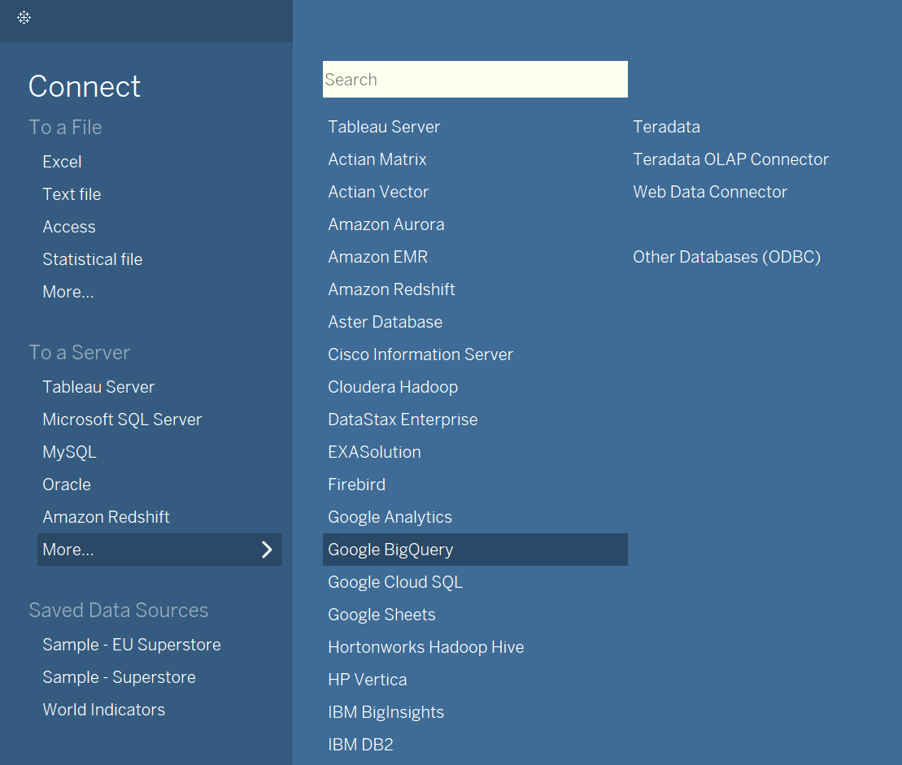
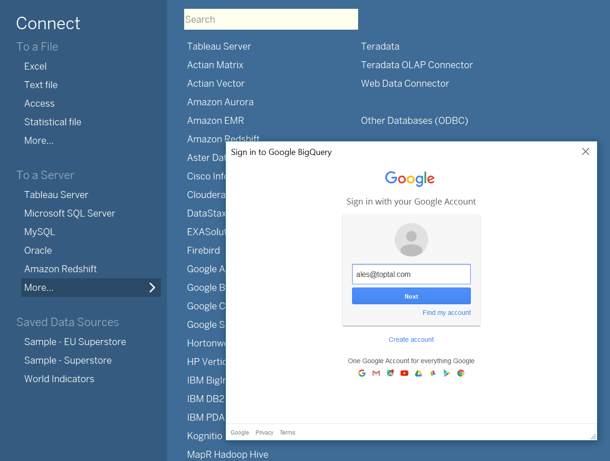
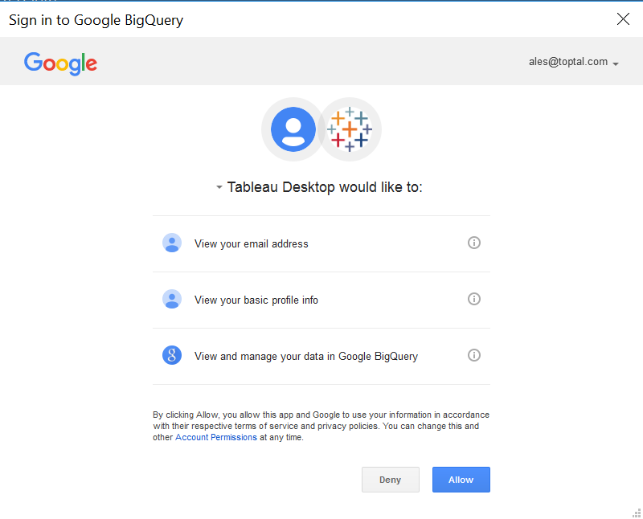
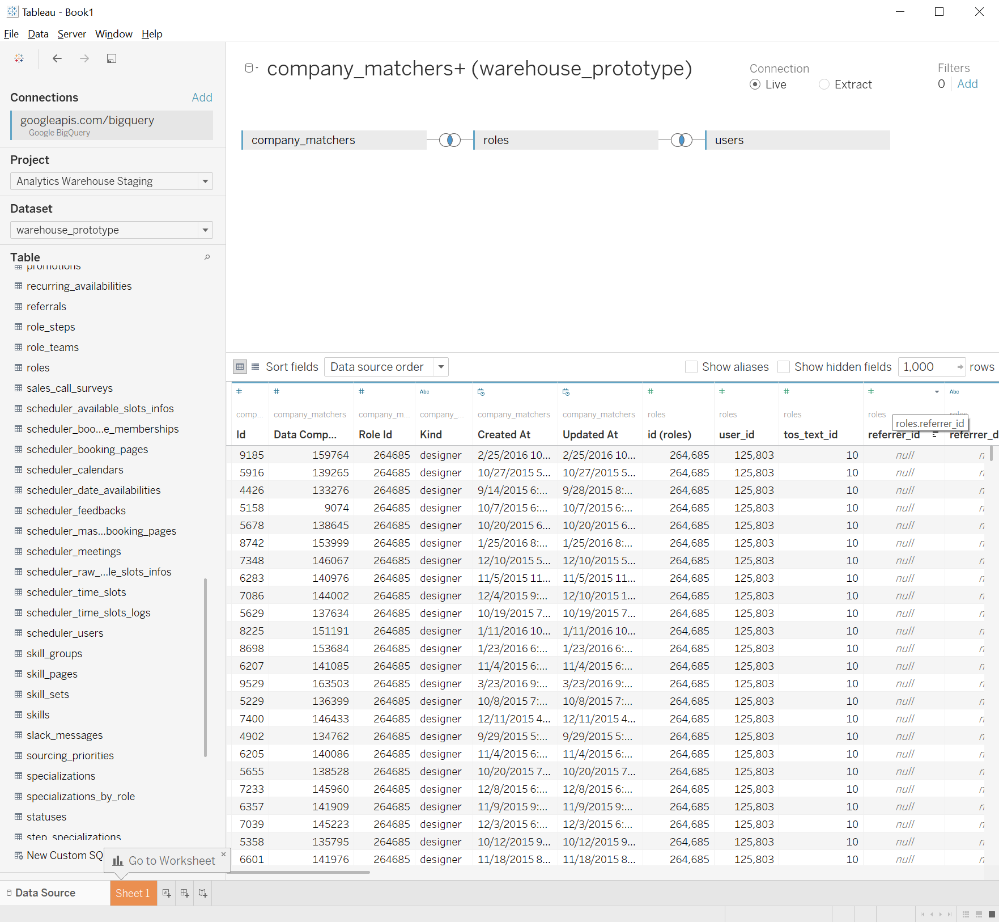
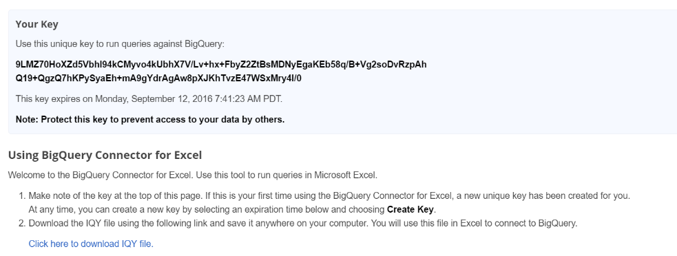
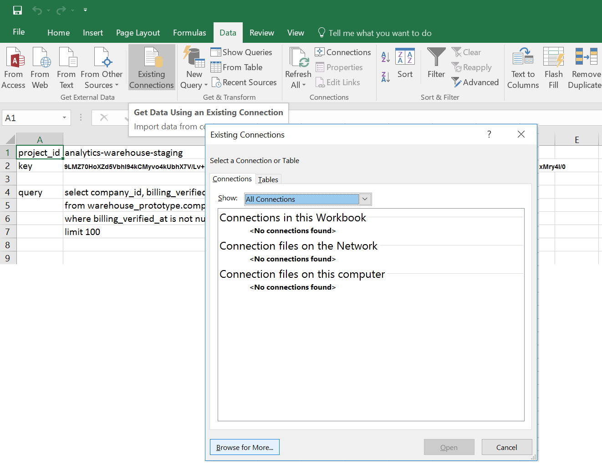
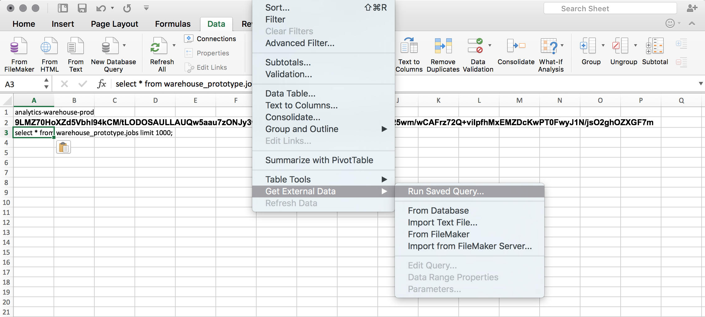

Connecting Clients
==================

.. toctree::
    Tableau
    Excel

.. contents:: :local:

Tableau
-------

1. In the menu on the left click **More ..** under the **Connect/To a Server** heading
and choose **Google BigQuery**

2. You'll be asked to sign in with your Google hosted Toptal's email account.

3. After signing in, grant tableau access to email address, basic profile info and rights to view Google BigQuery data.

4. On the left sidebar, choose ``Analytics Warehouse Prod`` (note that in the figure, staging is selected) as **Project**
and ``warehouse_protoype`` for
**Dataset**. You're good to go. Let's start by dragging tables to tableau workspace.

Excel
-----

1. Go to `BigQuery Connector for Excel`_ application, grant it access to BigQuery data

You'll be provided a **private access key** (which will expire in 1 hour but you can generate a new one with
different expiration time) and `connector IQY file`_ which you should download to your Mac/PC.

2. Open an empty spreadsheet and put:

- **project_id** (``analytics-warehouse-prod``) in the 1st line
- **private access key** to the 2nd line
- **SQL query** to the 3rd. The Query could be broken to as many subsequent lines as you need.

3a. On **Windows**, click on **Data > Get External Data** and then on **Browse for More**.

3b. On **Mac**, click on **Data > Get External Data > Run Saved Query**.

4. Select the `connector IQY file`_ that you downloaded before.

5. Decide where to put the **results of a query** (usually in a new sheet).

6. Enter the cell (or range of cells) containing **SQL query**. It's a good practice to run the
   query in `BigQuery console`_ first to make sure it does not contain errors.

7. Enter the cell with your project name.

8. Enter the cell with access key you downloaded from `BigQuery Connector for Excel`_.

.. note::

  If you get ``Access Denied`` error, check:

  1. that you were logged with your company account, when accessing the `BigQuery Connector for Excel`_ and
  2. your key has not expired (in that case, generate a new one)

.. _connector IQY file: https://bigquery-connector.appspot.com/download

.. _BigQuery Connector for Excel: https://bigquery-connector.appspot.com/

.. _BigQuery console: https://bigquery.cloud.google.com/queries/analytics-warehouse-prod
